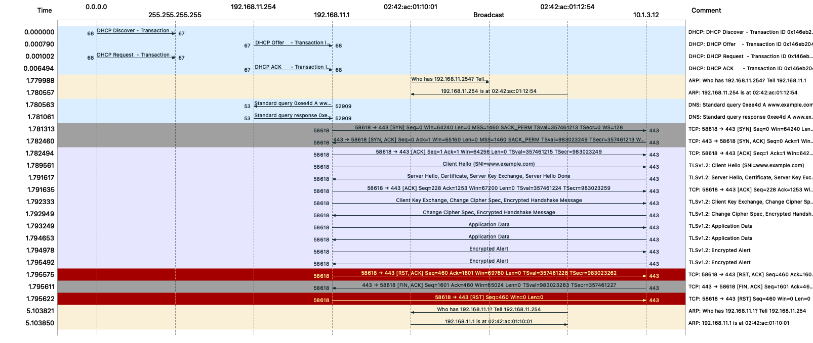

# Capture

## Overview

A virtual network environment built with Docker containers and tinet to observe and learn network protocols through packet capture and analysis.



## Project Structure
```
.
├── env
│   ├── base
│   │   ├── check_mac.sh
│   │   └── setup_mac.sh
│   └── env.yaml
├── images
│   └── structure.png
├── L2
│   ├── 2-1_ethernet
│   │   ├── datalink.png
│   │   └── ethernet.pcapng
│   ├── 2-2_arp
│   │   ├── arp.pcapng
│   │   └── arp.png
│   ├── 2-3_VLAN
│   │   ├── portVLAN
│   │   │   ├── 00_fw1.pcapng
│   │   │   ├── 00_fw1.png
│   │   │   ├── 01_lb1.pcapng
│   │   │   ├── 01_lb1.png
│   │   │   ├── 10_fw1.pcapng
│   │   │   ├── 10_fw1.png
│   │   │   ├── 11_lb1.pcapng
│   │   │   └── 11_lb1.png
│   │   └── tagVLAN
│   │       ├── lb1.pcapng
│   │       ├── lb1.png
│   │       └── sw2_mcaddtable.txt
│   └── L2.yaml
├── L3
│   ├── 3-1_internet_protocol
│   │   ├── ip.pcapng
│   │   └── ip.png
│   ├── 3-2_internet_control_message_protocol
│   │   ├── icmp.pcapng
│   │   └── icmp.png
│   ├── 3-3_network_address_translation
│   │   ├── nat.pcapng
│   │   └── nat.png
│   ├── 3-4_network_address_port_translation
│   │   ├── napt.pcapng
│   │   └── napt.png
│   └── L3.yaml
├── L4
│   ├── 4-1_user_datagram_protocol
│   │   ├── udp.pcapng
│   │   └── udp.png
│   ├── 4-2_transmission_control_protocol
│   │   ├── tcp.pcapng
│   │   └── tcp.png
│   ├── 4-3_firewall
│   │   ├── tcp_fw.txt
│   │   └── udp_fw.txt
│   └── L4.yaml
├── L7
│   ├── 7-1_hyper_text_transfer_protocol
│   │   ├── http.pcapng
│   │   └── http.png
│   ├── 7-2_secure_socket_layer_transport_layer_security
│   │   ├── https.pcapng
│   │   └── ssl:tls.png
│   ├── 7-3_domain_name_system
│   │   ├── dns.pcapng
│   │   └── dns.png
│   ├── 7-4_dynamic_host_configuration_protocol
│   │   ├── dhcp.pcapng
│   │   └── dhcp.png
│   ├── 7-5_load_balancer
│   │   ├── cookie_persistence
│   │   │   ├── client_log.txt
│   │   │   ├── haproxy
│   │   │   │   ├── log.txt
│   │   │   │   └── settings.txt
│   │   │   └── server1_log.txt
│   │   └── roundrobin
│   │       ├── client_log.txt
│   │       ├── haproxy
│   │       │   ├── log.txt
│   │       │   └── settings.txt
│   │       └── server1_log.txt
│   ├── 7-6_SSL_offload
│   │   ├── client_log.txt
│   │   ├── haproxy
│   │   │   ├── server.crt
│   │   │   └── settings.txt
│   │   └── server1_log.txt
│   └── L7.yaml
├── overview
│   ├── overview.pcapng
│   └── overview.png
└── README.md
```

## References
### Books
[みやたひろし (2024). *体験しながら学ぶ ネットワーク技術入門*. SBクリエイティブ.](https://www.sbcr.jp/product/4815618599/)