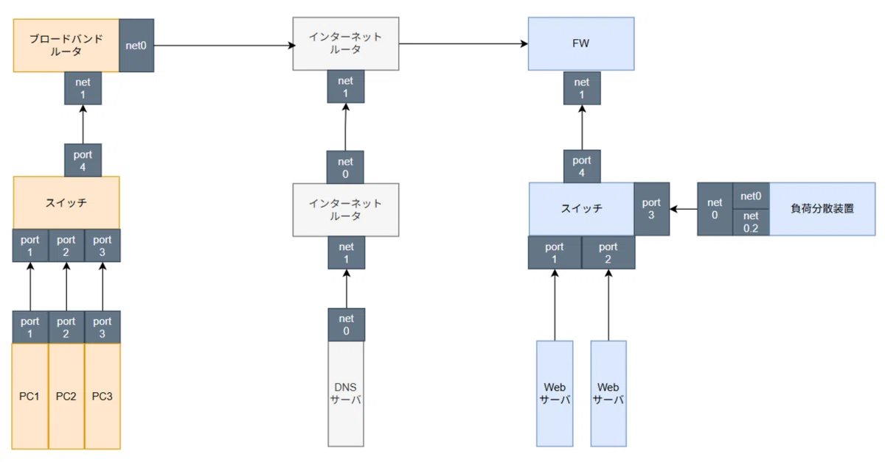

# Capture

## Overview

A virtual network environment built with Docker containers and tinet to observe and learn network protocols through packet capture and analysis.

## Project Structure

```
├── architecture.drawio
├── env
│   ├── base
│   │   ├── check_mac.sh
│   │   └── setup_mac.sh
│   └── env.yaml
├── L2
│   ├── 2-1_ethernet
│   │   ├── datalink.png
│   │   └── ethernet.pcapng
│   ├── 2-2_arp
│   │   ├── arp.pcapng
│   │   └── arp.png
│   ├── 2-3_VLAN
│   │   ├── portVLAN
│   │   │   ├── 00_fw1.pcapng
│   │   │   ├── 00_fw1.png
│   │   │   ├── 01_lb1.pcapng
│   │   │   ├── 01_lb1.png
│   │   │   ├── 10_fw1.pcapng
│   │   │   ├── 10_fw1.png
│   │   │   ├── 11_lb1.pcapng
│   │   │   └── 11_lb1.png
│   │   └── tagVLAN
│   │       ├── lb1.pcapng
│   │       ├── lb1.png
│   │       └── sw2_mcaddtable.txt
│   └── L2.yaml
├── L3
│   ├── 3-1_internet_protocol
│   │   ├── ip.pcapng
│   │   └── ip.png
│   ├── 3-2_internet_control_message_protocol
│   │   ├── icmp.pcapng
│   │   └── icmp.png
│   ├── 3-3_network_address_translation
│   │   ├── nat.pcapng
│   │   └── nat.png
│   ├── 3-4_network_address_port_translation
│   │   ├── napt.pcapng
│   │   └── napt.png
│   └── L3.yaml
├── L4
│   ├── 4-1_user_datagram_protocol
│   │   ├── udp.pcapng
│   │   └── udp.png
│   ├── 4-2_transmission_control_protocol
│   │   ├── tcp.pcapng
│   │   └── tcp.png
│   ├── 4-3_firewall
│   │   ├── tcp_fw.txt
│   │   └── udp_fw.txt
│   └── L4.yaml
├── L7
│   ├── 7-1_hyper_text_transfer_protocol
│   │   ├── http.pcapng
│   │   └── http.png
│   ├── 7-2_secure_socket_layer_transport_layer_security
│   │   ├── https.pcapng
│   │   └── ssl:tls.png
│   ├── 7-3_domain_name_system
│   │   ├── dns.pcapng
│   │   └── dns.png
│   ├── 7-4_dynamic_host_configuration_protocol
│   │   ├── dhcp.pcapng
│   │   └── dhcp.png
│   ├── 7-5_load_balancer
│   │   ├── cookie_persistence
│   │   │   ├── client_log.txt
│   │   │   ├── haproxy
│   │   │   │   ├── log.txt
│   │   │   │   └── settings.txt
│   │   │   └── server1_log.txt
│   │   └── roundrobin
│   │       ├── client_log.txt
│   │       ├── haproxy
│   │       │   ├── log.txt
│   │       │   └── settings.txt
│   │       └── server1_log.txt
│   ├── 7-6_SSL_offload
│   │   ├── client_log.txt
│   │   ├── haproxy
│   │   │   ├── server.crt
│   │   │   └── settings.txt
│   │   └── server1_log.txt
│   └── L7.yaml
├── overview
│   ├── overview.pcapng
│   └── overview.png
└── README.md
```

## Network Topology


## Components

### Network Nodes

| Node | Role | Observed Protocols |
|------|------|-------------------|
| **cl1, cl2, cl3** | DHCP Clients | DHCP, ARP, DNS queries |
| **rt1** | NAT Gateway | DHCP server, SNAT, routing |
| **rt2, rt3** | Routers | OSPF, static routing |
| **fw1** | Firewall | iptables, DNAT, stateful filtering |
| **ns1** | DNS Resolver | Recursive DNS queries, Unbound |
| **lb1** | Load Balancer | HAProxy, BIND9, SSL termination |
| **sv1, sv2** | Web Servers | HTTP/HTTPS, nginx, TLS 1.2 |
| **sw1, sw2** | Switches | L2 switching, VLAN tagging |

## Captured Protocols by Layer

### Layer 2 (Data Link)
- **Ethernet** - Frame structure, MAC addressing
- **ARP** - Address resolution (IP to MAC mapping)
- **VLAN** 
  - Port-based VLAN (access ports)
  - 802.1Q tagged VLAN (trunk ports)
  - MAC address table learning

### Layer 3 (Network)
- **IP** - Packet structure, addressing, TTL
- **ICMP** - Echo request/reply, error messages
- **NAT** - Source NAT (SNAT) for outbound traffic
- **NAPT** - Network Address Port Translation

### Layer 4 (Transport)
- **UDP** - Connectionless datagram delivery
- **TCP** - Connection establishment, data transfer, teardown
- **Firewall** - Stateful packet filtering with iptables

### Layer 7 (Application)
- **HTTP** - Request methods, headers, status codes
- **HTTPS** - TLS handshake, certificate exchange
- **DNS** - Recursive queries, authoritative responses
- **DHCP** - DORA process (Discover, Offer, Request, Acknowledge)
- **Load Balancing**
  - Round-robin distribution
  - Cookie-based session persistence
  - SSL offloading

## Key Learning Points

### NAT/NAPT Implementation
- **NAT** for client internet access via rt1
- Port translation and connection tracking

### VLAN Configuration
- **Port VLAN** (Access mode) - Untagged traffic on sw2 ports 1, 2, 4
- **Tagged VLAN** (Trunk mode) - 802.1Q tagging on sw2 port 3
- VLAN 1: Management/Load Balancer segment
- VLAN 2: Web server segment
- MAC address table analysis

### DNS Hierarchy
- **Root nameserver** (172.16.3.51)
- **TLD server** for .com (172.16.3.52)
- **Authoritative server** for example.com (172.16.3.53)
- **Recursive resolver** (ns1 with Unbound)
- Split-horizon DNS for internal/external views
- Complete query flow captured from client to root

### Load Balancing Techniques
- **Round-robin** algorithm with health checks
- **Cookie persistence** for session affinity
- **SSL termination** at HAProxy
- X-Forwarded-For header injection
- Server health monitoring

### Firewall Rules
- Stateful inspection (ESTABLISHED, RELATED, NEW)
- Default-deny policy on FORWARD chain
- Service-specific allow rules (DNS, HTTP, HTTPS, ICMP)
- Connection tracking with conntrack

## Technology Stack

| Category | Tool | Purpose |
|----------|------|---------|
| Orchestration | **tinet** | Network topology builder |
| Containerization | **Docker** | Isolated network nodes |
| Routing | **FRRouting** | OSPF and routing daemon |
| Switching | **Open vSwitch** | Software-defined VLAN switch |
| Load Balancing | **HAProxy** | L7 load balancer |
| DNS | **BIND9** | Authoritative DNS server |
| DNS | **Unbound** | Recursive DNS resolver |
| DNS/DHCP | **dnsmasq** | Lightweight DNS/DHCP server |
| Web Server | **nginx** | HTTP/HTTPS server |
| Firewall | **iptables** | Packet filtering and NAT |
| Analysis | **Wireshark** | Packet capture analysis |

## Capture Files

All packet captures (`.pcapng`) include:
- Detailed protocol dissection
- Screenshots (`.png`) of Wireshark analysis
- Configuration files where applicable
- Server/client logs for correlation
